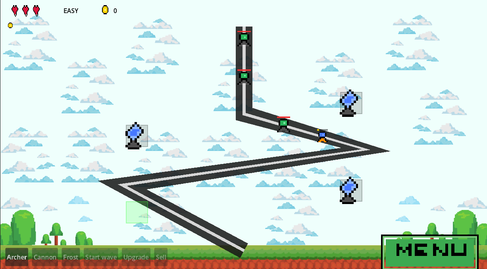
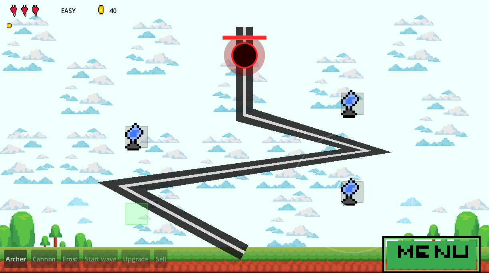

# 🗼 Tower Defense — Godot + C#

> Klasyczna gra tower defense zbudowana w **Godot 4** z logiką gry napisaną w **C#**.  
> Trzy mapy o rosnącym poziomie trudności, pięć typów wrogów i boss z muzyką.

---

## 📸 Zrzuty ekranu






---

## 🎮 Funkcje

| Funkcja | Opis |
|---|---|
| **3 mapy** | Easy / Medium / Hard — każda z inną trasą i trudnością |
| **3 typy wież** | Archer (szybki), Cannon (splash), Frost (spowalnia) |
| **5 typów wrogów** | Grunt, Fast, Tank, Flying, Boss |
| **System fal** | Wrogowie spawnują się falami, boss pojawia się na końcu |
| **Ulepszanie wież** | Każdą wieżę można ulepszyć lub sprzedać |
| **Boss** | Natychmiastowa przegrana gdy dotrze do końca + muzyka |
| **Monety między mapami** | Zarobione złoto przechodzi na kolejną mapę |

---

## 🏗️ Architektura

```
Tower-Defense-Godot/
├── Scripts/
│   ├── GameEngine.cs       # Cała logika gry (pure C#, bez Godot)
│   ├── GameController.cs   # Mostek Godot ↔ GameEngine, rysowanie, dźwięk
│   ├── GameTypes.cs        # Modele danych: Enemy, Tower, Projectile, Pad…
│   ├── Hud.cs              # UI: życia, monety, nakładki Victory/Defeat
│   ├── SceneNav.cs         # Nawigacja między scenami, GameSession
│   ├── MainMenu.cs         # Ekran główny
│   ├── LevelSelect.cs      # Wybór mapy
│   └── Options.cs          # Opcje
├── Scenes/
│   ├── Game.tscn
│   ├── MainMenu.tscn
│   ├── LevelSelect.tscn
│   └── Options.tscn
└── assets/
    ├── sprites/
    └── sfx/
```

### Przepływ danych

```
_UnhandledInput
      │
      ▼
GameController  ──►  GameEngine.Update()  ──►  Events (OnBossSpawned, OnDefeat…)
      │                                               │
      ▼                                               ▼
  _Draw()                                         Hud.Refresh()
```

`GameEngine` jest czystą klasą C# — nie zależy od Godota, co ułatwia testowanie jednostkowe.

---

## 🚀 Uruchomienie

### Wymagania

- [Godot 4.x — wersja .NET](https://godotengine.org/download/)
- [.NET SDK 8.0+](https://dotnet.microsoft.com/download)

### Kroki

```bash
git clone https://github.com/TWOJ_NICK/tower-defense-godot.git
cd tower-defense-godot
```

Otwórz projekt w Godot Editor → kliknij **Run** (F5).

---

## 🧩 Typy wrogów

| Typ | Cecha szczególna |
|---|---|
| Grunt | Standardowy wróg |
| Fast | Bardzo szybki, mało HP |
| Tank | Wolny, bardzo dużo HP |
| Flying | Leci nad ścieżką (ignoruje splash) |
| **Boss** | Pojawia się ostatni — natychmiastowa przegrana przy dotarciu do celu |

---

## 🏰 Typy wież

| Wieża | Obrażenia | Zasięg | Specjalne |
|---|---|---|---|
| Archer | Niskie | Średni | Szybkostrzelna |
| Cannon | Wysokie | Długi | Splash — trafia pobliskich wrogów |
| Frost | Bardzo niskie | Średni | Spowalnia cel |

---

## 📄 Dokumentacja

Dokumentacja znajduje w folderze Scripts/html.
